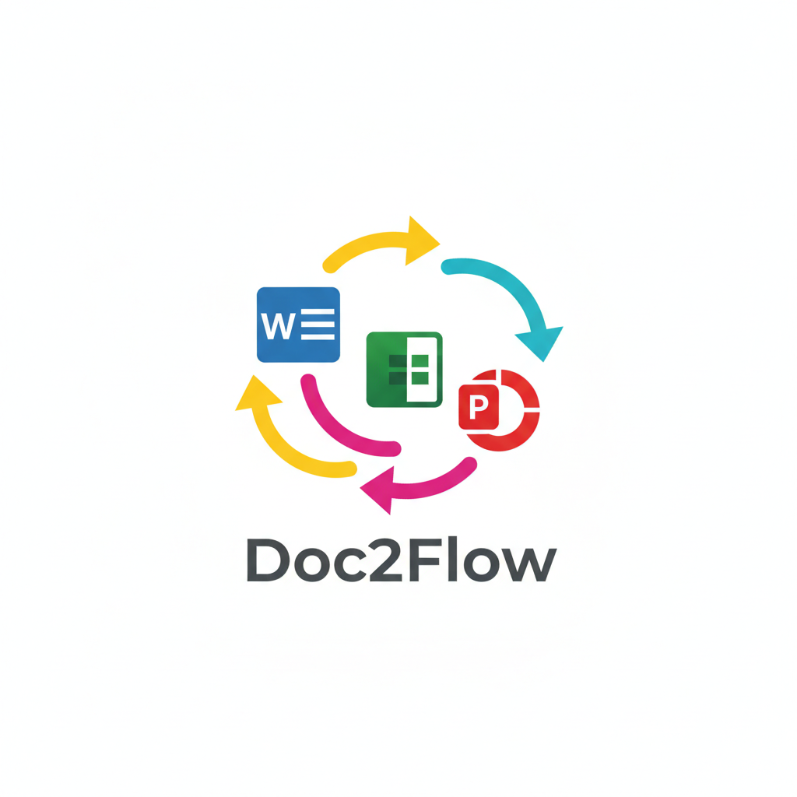
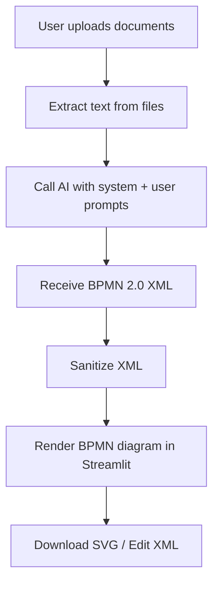
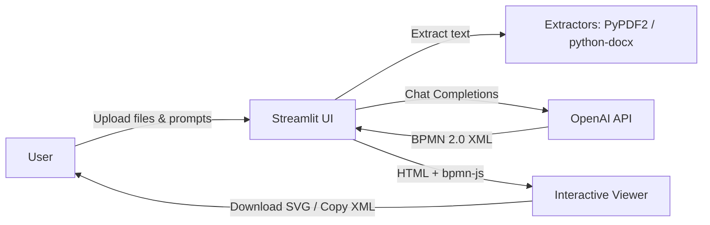

# Doc2Flow

Created during the Tax Tech Hackathon

Turn unstructured documents into clear BPMN 2.0 workflows. Upload PDFs, Word files, text or Markdown, and Doc2Flow uses an AI model to analyze the process and render an interactive BPMN diagram you can inspect and download.

## How it works

1) Upload files (PDF, DOCX, TXT, MD)
2) Extract text (PyPDF2 / python-docx)
3) Generate BPMN 2.0 XML via AI (OpenAI Chat Completions) using `system_prompt.md`
4) Sanitize the XML (strip markdown fences if any)
5) Render the diagram with bpmn-js inside Streamlit
6) Download the diagram as SVG or copy/edit the XML

### High-level workflow (Mermaid)



### Components and data flow



## Key features

- Multi-format ingestion: PDF, DOCX, TXT, MD
- Chat-style UI with prompts for generate/modify/explain/download
- Interactive BPMN viewer (bpmn-js) embedded in Streamlit
- Download as SVG, view/edit raw BPMN XML
- Configurable AI model and parameters via `config.py` and `.env`
- Built-in logging to `doc2flow.log` with optional sidebar log viewer

## Project structure

- `streamlite-test1.py` — Streamlit app (UI, file handling, AI calls, BPMN viewer)
- `config.py` — AI provider/model configuration and app settings
- `system_prompt.md` — System prompt for BPMN generation
- `ai_service.py` — Planned unified AI service (OpenAI/Anthropic/Gemini)
- `ai_cleaner_service.py` — Planned XML cleaner service (not wired into UI yet)
- `cleaner_config.py` — Cleaner service configuration
- `requirements.txt` — Python dependencies
- `start_app.sh` — Helper script to load `.env` and run the app
- `doc2flow.log` — Runtime logs

Note: The current Streamlit app path uses OpenAI directly; Anthropic/Gemini stubs exist but are not enabled in the UI.

## Prerequisites

- Python 3.10+
- An OpenAI API key

Optional (placeholders only at the moment): Anthropic or Google Gemini API keys

## Setup

1) Create and activate a virtual environment

```bash
python -m venv venv
source venv/bin/activate
```

2) Install dependencies

```bash
pip install -r requirements.txt
```

3) Configure environment

Create a `.env` file in the project root:

```
OPENAI_API_KEY="your-openai-api-key"
# Optional for future providers
ANTHROPIC_API_KEY="your-anthropic-api-key"
GEMINI_API_KEY="your-gemini-api-key"
```

Optionally adjust `AI_PROVIDER`, `model`, `temperature`, and token limits in `config.py` (default provider is `openai`).

## Run

Use the helper script (zsh):

```bash
chmod +x start_app.sh
./start_app.sh
```

Or run Streamlit directly:

```bash
streamlit run streamlite-test1.py
```

The app opens in your browser. Upload files, click “Generate Workflow”, then interact with the diagram or download it as SVG. Use the sidebar to view recent logs.

## Notes and limits

- Supported file types: PDF, DOCX, TXT, MD (default max size ≈ 10 MB; see `config.APP_CONFIG`).
- The UI currently strips markdown code fences around XML; an AI-based XML cleaner exists as a separate module but is not yet used in the Streamlit flow.
- BPMN schemas in the repo are for context only and are not required to run the UI.

## Troubleshooting

- Missing API key: ensure `.env` contains `OPENAI_API_KEY` and that `start_app.sh` or your shell loads it.
- Empty PDF text: some PDFs have images only; OCR is not included.
- Diagram won’t render: open the XML via “Show/Edit BPMN XML” to inspect for malformed content.

—

This project was created during the Tax Tech Hackathon.
